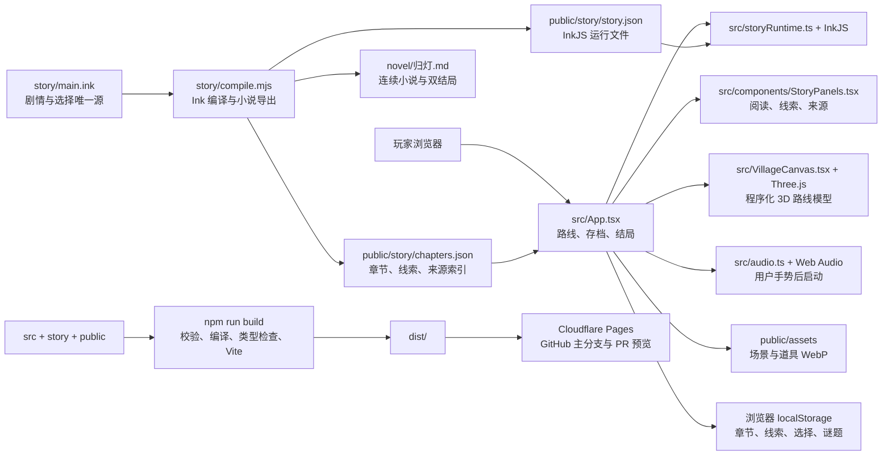

# 《归灯》应用架构

## 运行时结构

## 模块边界

| 模块 | 职责 | 不负责 |
| --- | --- | --- |
| `story/main.ink` | 十二站正文、交互选项、结局文本和剧情状态 | 页面排版、颜色与动画 |
| `story/sources.json` | 典籍、档案、研究、作品来源与可支持范围 | 替创作情节背书 |
| `story/compile.mjs` | 编译 Ink、抽取章节标签、嵌入来源并导出小说 | 手工维护副本内容 |
| `src/App.tsx` | 章节状态、路线切换、线索/选择存档、结局和弹层协调 | 直接写逐章长篇正文 |
| `src/components/StoryPanels.tsx` | 阅读分页、章节导航、线索手记、来源卡、结局卡 | Three.js 世界建模 |
| `src/VillageCanvas.tsx` | 坡地、沿巷转向的石屋、石阶、水面、十二个热点、旋转与缩放 | 实测地图定位；它是故事路线模型 |
| `src/audio.ts` | 通过 Web Audio 合成环境声与稀疏动作提示 | 播放影视/游戏原声或承担唯一线索 |
| `public/assets/` | 已压缩的运行时背景与道具 WebP | 可核验文字、地图地名或史料引文 |

## 内容构建与发布

`npm run build` 先调用 `story/compile.mjs`，同步生成 InkJS JSON、章节索引和 [`novel/归灯.md`](../novel/归灯.md)，再运行 `tsc -b` 和 Vite 生产构建。内容、来源或选择更新后，应一并提交 Ink 源、`story/sources.json`、生成章节文件和小说；CI 会运行来源校验和小说漂移检查。

应用不依赖账号、API、数据库或服务端路由。玩家进度保存在当前浏览器的 `localStorage`；清除浏览器站点数据会重置进度。Cloudflare Pages 只接收 Vite 生成的 `dist/`。GitHub Actions 负责类型、故事、单元测试、浏览器测试和构建；Pages Git 集成在 PR 生成预览，在生产分支生成正式部署。部署参数与首次集成步骤见 [`deployment.md`](deployment.md)。

## 交互降级与设备

WebGL 初始化失败时，地图面板仍保留十二站的可访问路线清单。桌面可拖动模型旋转、滚轮缩放；手机使用触摸控制并可从清单进入站点。页面本身固定在一个视口中；剧情正文和弹层资料以屏内分页/面板形式呈现，不靠整页滚轮推进。环境声默认关闭，只在点击“举灯入巷”或声音控件后启动。
